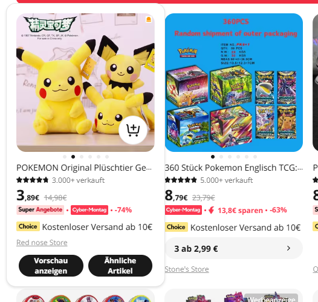
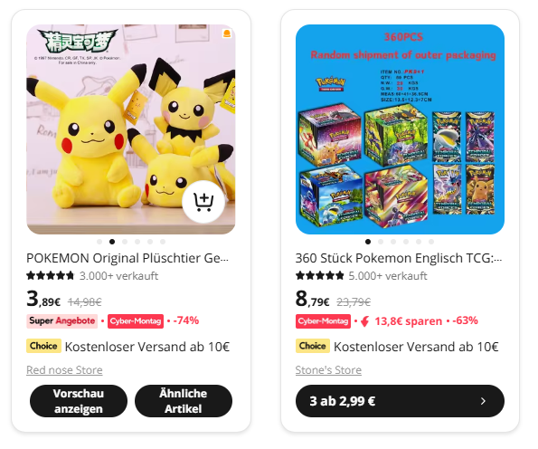
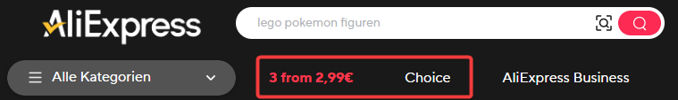
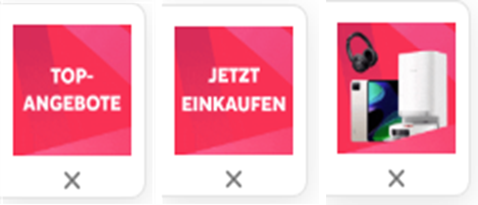
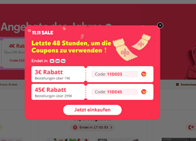
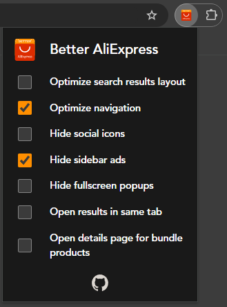

  

# Better AliExpress

Extension to enhance your AliExpress experience

## Features

  
<b>Optimize search results layout</b>

- Expand the spacing between results for improved readability
- Display results in a card-based layout
- Eliminate hover effects on results
- Ensure all available buttons for each result are always visible
- Standardize the order of elements within result cards
- Use consistent colors for buttons across all cards
- Ensure all result cards have a uniform height

| Before                                                                                                              | After                                                                                                             |
| ------------------------------------------------------------------------------------------------------------------- | ----------------------------------------------------------------------------------------------------------------- |
|  |  |

  
<b>Optimize navigation</b>

- Add a dropdown to the header for switching between Normal, Choice, and Bundle pages
- Remove redundant Choice and Bundle links from the menu

| Before                                                                     | After                                                                                 |
| -------------------------------------------------------------------------- | ------------------------------------------------------------------------------------- |
|  |  |

  
<b>Hide social icons</b>

- Hide the sidebar with social icon links

  

  
<b>Hide sidebar ads</b>

- Hide popup ads on the side of the screen

  

  
<b>Hide fullscreen popups</b>

- Hide fullscreen popup ads

  

  
<b>Open results in same tab</b>

- By default, clicks on a search result open in a new tab. When activated, the details page of the result opens in the current tab

  
<b>Open details page for bundle products</b>

- By default, clicks on a search result of a bundle product navigate to the bundle offers page. When activated, it only does that when you click on the bundle button. Otherwise, clicks open the normal details page of the product

## Installation

The extension is not available on the Chrome Web Store or Firefox Add-ons store, so manual installation is required.

1. Download the ZIP file from [GitHub Releases](https://github.com/DerStimmler/better-aliexpress/releases)
2. Extract the ZIP file to a folder

### Chromium (Google Chrome, Edge, Brave, ...)

3. Open `chrome://extensions/`
4. Enable _Developer mode_
5. Click _Load unpacked_ and select the folder where you extracted the ZIP
6. The extension will appear in your extensions list and its icon will show in the toolbar

### Firefox

Because the extension is not signed yet, you can only install it temporarily. It will be removed automatically when you close the browser.

3. Open `about:debugging#/runtime/this-firefox`
4. Click _Load Temporary Add-on..._
5. Choose the extracted folder and select the `manifest.json` file
6. The extension will appear in your add-ons list and its icon will show in the toolbar

## Usage

Open the extension popup from your toolbar and toggle the features you wish to enable or disable.

## Compatibility

> [!IMPORTANT]
> Currently the extension only works on AliExpress sites with the domain `https://*.aliexpress.com`

## Development

### Tips

- For easier debugging open the popup of the extension directly in a new tab. Get the extension ID in the extension details overview. `chrome-extension://<extension-id>/src/popup/index.html`
- To view the extension storage open the popup in a new tab, open DevTools and execute `chrome.storage.local.get(console.log)` in console

### Commands

- Run dev server `pnpm dev`
- Fix linting `pnpm lint:write`
- Run e2e tests with ui `pnpm test:ui`
