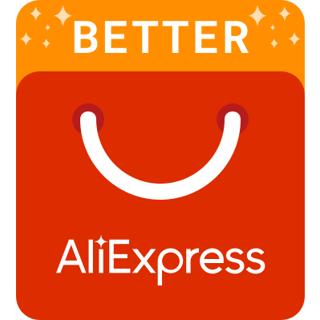
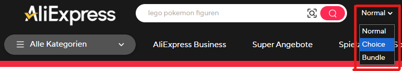

  

# Better AliExpress

Extension to enhance your AliExpress experience

## Features

  
<b>Optimize search results layout</b>

- increases space between results
- show results as cards
- remove hover effect on results
- always show available buttons for result
- unify order of elements in result card
- unify button colors
- unify height of result cards

| Before                                                                                               | After                                                                                              |
| ---------------------------------------------------------------------------------------------------- | -------------------------------------------------------------------------------------------------- |
|  |  |

  
<b>Optimize navigation</b>

- adds dropdown to header for switching between Normal, Choice and Bundle pages
- removes redundant choice and bundle links from menu

| Before                                                                      | After                                                                         |
| --------------------------------------------------------------------------- | ----------------------------------------------------------------------------- |
|  |  |

  
<b>Hide social icons</b>

- Hides the sidebar with social icon links.

  

  
<b>Hide sidebar ads</b>

- Hides popup ads on the side of the screen

  

  
<b>Hide fullscreen popups</b>

- Hides fullscreen popup ads

  

  
<b>Open results in same tab</b>

- By default clicks on a search result is opened in a new tab. When activated the details page of the result is opened in the current tab.

  
<b>Open details page for bundle products</b>

- By default clicks on a search result of a bundle product navigates to the bundle offers page. When activated it only does that when you click on the bundle button. Otherwise clicks will open the normal details page of the product.

## Installation

The extension is not available in the Chrome Web Store or Firefox Add-ons store, so you'll need to install it manually.

1. Download the ZIP file from [GitHub Releases](https://github.com/DerStimmler/better-aliexpress/releases).
2. Extract the ZIP file to a folder.

### Chromium (Google Chrome, Edge, Brave, ...)

3. Open `chrome://extensions/` in Chrome (or go to _More tools_ > _Extensions_)
4. Enable _Developer mode_
5. Click _Load unpacked_ and select the folder where you extracted the ZIP
6. The extension will appear in your extensions list and its icon will show in the toolbar

### Firefox

Because the extension is not signed yet, you can only install it temporarily. It will be removed automatically when you close the browser.

3. Open `about:debugging#/runtime/this-firefox` in Firefox
4. Click _Load Temporary Add-on..._
5. Choose the extracted folder and select the `manifest.json` file
6. The extension will appear in your add-ons list and its icon will show in the toolbar

## Compatibility

> [!IMPORTANT]
> Currently the extension only works on AliExpress sites with the domain `https://*.aliexpress.com`

## Development

### Tips

- For easier debugging open the popup of the extension directly in a new tab. Get the extension ID in the extension details overview. `chrome-extension://<extension-id>/src/popup/index.html`
- To view the extension storage open the popup in a new tab, open DevTools and execute `chrome.storage.local.get(console.log)` in console

### Commands

- Run dev server `pnpm dev`
- Fix linting `pnpm lint:write`
- Run e2e tests with ui `pnpm test:ui`
